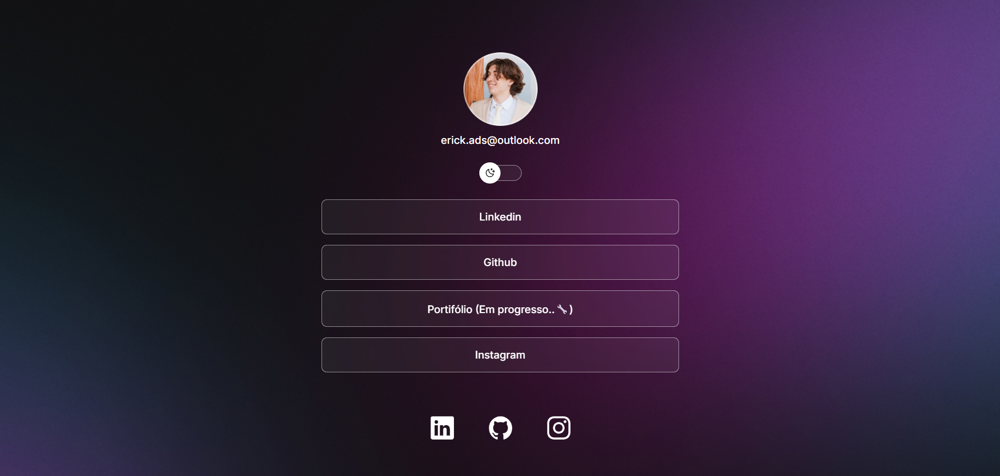

# DevLinks - Erick Anderson

##  [Acesse o projeto clicando aqui](https://ads-erick.github.io/DevLinks/)

Trata-se de um agregador de links pessoal, funcionando como uma link tree para centralizar redes sociais e portfólios.

## Tecnologias
Este projeto foi desenvolvido com as seguintes tecnologias:

- **HTML**: Estruturação de conteúdo e semântica.
- **CSS**: Estilização, variáveis, Flexbox e efeitos.
- **JavaScript**: Lógica de manipulação do DOM para alternância de temas.
- **Git/GitHub**: Versionamento de código.

## Projeto
O DevLinks é uma página de perfil que contém:
- Foto de perfil e identificação.
- Switch para troca de tema (Dark Mode e Light Mode).
- Lista de links principais.
- Ícones de redes sociais integrados via **IonIcons**.

## Funcionalidades
- **Modo Claro/Escuro**: Ao clicar no interruptor, a página altera dinamicamente as cores de fundo, texto e até a imagem do ícone do switch utilizando classes do JavaScript.
- **Responsividade**: O layout é adaptado para visualização em dispositivos móveis.